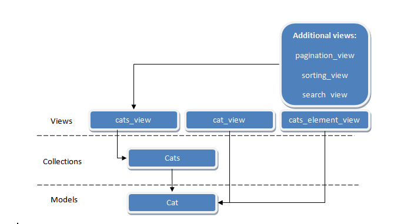

# Cats home

It is prototype of the cats web store.

Contains 2 pages

1. Page with list of cats
2. Page with information about single cat

Used library and frameworks:

* Backbone.js -  is a JavaScript framework with a RESTful JSON interface and is based on the model–view–presenter (MVP) application design paradigm.
* Twitter Bootstrap - css framework

Build system: webpack

## Installation
### Install dependencies

Install npm dependencies with command `npm install`. Node.js is required. Use this link to get it:
[https://nodejs.org](https://nodejs.org)

### Build application

 **For development**

 (.js and .css files will not be minified, bundle will be contain source map for .js files)

```npm run dev ```

Now you can use url http://localhost:8080 to get application.
In this mode webpack watch for source files and update build after any changes.

 **For production** (.js and .css files  minified, sorce map excluded)
```
npm run prod
npm start
```
 Application will be available at url http://localhost:8080
## Architecture

## API


GET api/cats/cats.json - return list of cats model in json format

example:
```
[
    {
      "id": 7,
      "price": 180,
      "vaccinated": true,
      "name": "Moe",
      "breed": "Siamese",
      "gender": 1,
      "birthday": 1336867200,
      "photos": [
        "js/assets/images/cats/moe_800x600.png"
      ]
    },
    {
      "id": 8,
      "vaccinated": true,
      "price": 180,
      "name": " Krusty",
      "breed": "Turkish Van",
      "gender": 1,
      "birthday": 1305244800,
      "description": "Very good and gay cat.",
      "photos": [
        "js/assets/images/cats/krusty_800x600.png"
      ]
    }
]
```


GET api/cats/ :id.json - return single model instance in json format

example:
```
{
  "id": 1,
  "vaccinated": true,
  "price": 100,
  "name": "Lisa",
  "breed": "Angora",
  "gender": 0,
  "birthday": 1273708800,
  "description": "Very good and smart cat.",
  "photos": [
    "js/assets/images/cats/lisa_800x600.png"
  ]
}
```

1. id - (int) id of model instance (Cat)
2. vaccinated - (boolean) presence of cat vaccinations
3. price - (float) price of cat in $
4. name - (string) name of cat
5. breed - (string) breed of cat
6. birthday - (string) birthday of cat in unix time format
7. description - (string) additional information about cat
8. photos - (Array of strings) - list of cat photos